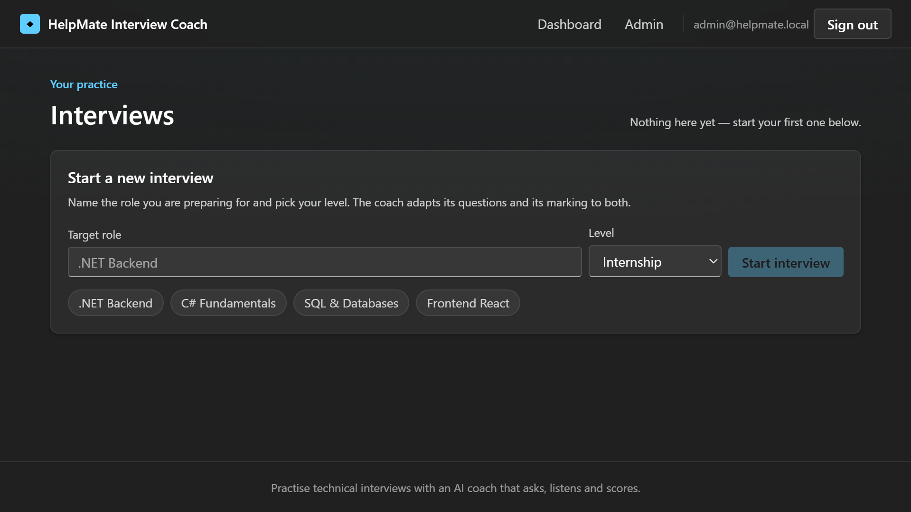
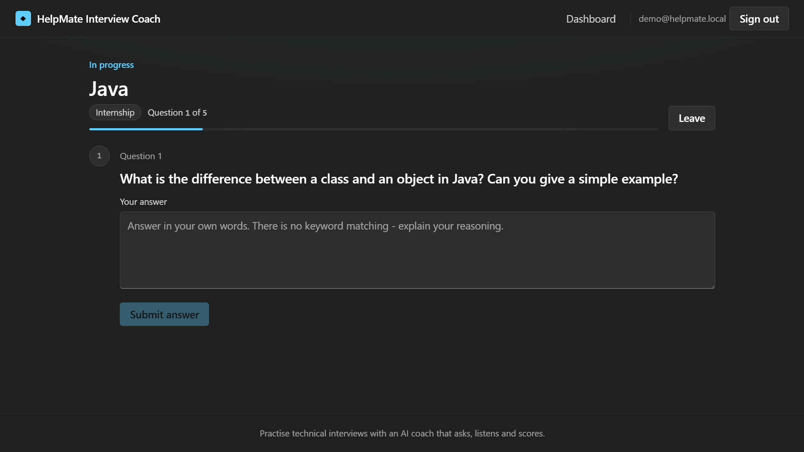
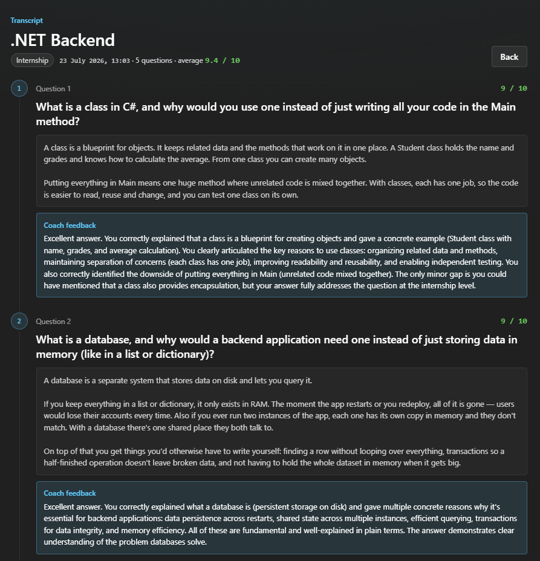

# HelpMate Interview Coach

**An AI agent that runs technical interviews.** Pick the role you are preparing for and the level you
are aiming at, and it asks you questions one at a time, reads your free-text answers, scores them out
of ten and explains what was missing. Every session is saved so you can watch yourself improve.


### ▶ [Try the live demo](https://helpmate-interview-coach-g2bgbnaua5cyd5cb.germanywestcentral-01.azurewebsites.net)

Click **See a sample interview** on the landing page to sign in as a demo account with finished
interviews you can browse immediately — no sign-up needed. Or create an account and run a real one:
the coach adapts to any role, at any level from internship to senior.

---

## Screenshots

**Your history, with scores over time**



**Running an interview: one question at a time, calibrated to the level you chose**



**A finished interview: question, your answer, the coach's verdict**



---

## What this project demonstrates

### An AI agent that calls real backend functions

Not a chatbot with a system prompt. The model is given three tools that map onto real operations —
`save_question`, `save_answer_feedback`, `complete_session` — and it decides when to call them.

The tools **are** the application's own domain operations, so the model is subject to the same
rules as a human user. Ask for a sixth question in a five-question interview and the call is
rejected — and the rejection message is handed back to the model, which reads it and closes the
interview instead:

```
Rejected: This session already has the maximum of 5 questions.
          Complete the session instead of asking another one.
```

A business rule becomes feedback that corrects the agent's behaviour. Nothing about the model is
trusted: it cannot exceed the question limit, cannot return a score of 47 out of 10, and cannot
write to a session that is not the caller's.

### One agent, two interchangeable AI providers

The AI provider sits behind a `Core` interface, `IAiInterviewer`, with two implementations: a local
model through [Ollama](https://ollama.com) for free local development, and the hosted
[Claude](https://www.anthropic.com/claude) API for the deployed demo. You switch between them with a
single configuration value — the rest of the application never knows which one is running.

The interesting part is what the two implementations share. All of the logic — the agent loop, the
prompts, the sequencing, tool execution — lives once in an abstract base class,
`InterviewerBase<TConversation>`. Each provider implements only four small hooks that translate to
its own SDK. Adding Claude alongside Ollama was one new file of roughly a hundred lines; not a single
line of interview logic was duplicated or changed.

### Authentication and authorisation done properly

ASP.NET Core Identity issues JWTs. Endpoints are protected by default, every read and write is
scoped to the signed-in user, and the Admin role unlocks a separate set of endpoints (browse every
account, delete any session). The UI is just another client of the same public API — it authenticates
with the same token an external consumer would use.

---

## Architecture

Four projects, a monolith, with dependencies pointing inwards.

```
Api             Controllers, Blazor UI, composition root  →  Core, Infrastructure
Infrastructure  EF Core, Identity, the AI agent           →  Core
Core            Entities, business rules, interfaces       →  (nothing)
Tests           Unit tests                                 →  Core
```

`Core` references no other project and no infrastructure package. It owns the entities, the
interview rules and the interfaces (`IInterviewRepository`, `IAiInterviewer`, `ITokenService`);
`Infrastructure` implements them. That inversion is what makes the AI provider and the database
swappable, and what lets the business rules be tested with no database, no network and no AI.

Some consequences worth pointing out:

- **`InterviewSession.UserId` is a plain string, not a navigation property to `ApplicationUser`.**
  Identity lives in `Infrastructure`; if the entity referenced it, `Core` would depend on Identity.
  Ownership is enforced by comparing that string — and the entire authentication layer was added
  later without touching `Core` at all.
- **Configuration uses the Fluent API, not data annotations.** `[Key]` and `[Required]` are EF
  types, and putting them on entities would drag EF into `Core`.
- **The agent's tools are `InterviewService` methods.** There is no separate rule engine for the AI.

---

## How a session works

```
POST /api/sessions               create a session for a target role and difficulty
POST /api/sessions/{id}/advance  the agent asks the next question, or scores the last answer
POST /api/sessions/{id}/answers  submit an answer
GET  /api/sessions               your history
GET  /api/sessions/{id}          one full transcript
```

`advance` returns nothing from the agent itself — the agent's output **is** its side effects,
written through its tools. The endpoint then reads the session back and returns it, so the database
stays the single source of truth.

Sequencing (evaluate the pending answer → ask the next question → finish) is computed in code
rather than left to the model, because small local models get it wrong. The model still owns the
parts that need judgement: what to ask, and how good an answer is.

**Difficulty calibrates both the questions and the marking.** The chosen level (internship, junior,
mid, senior) is stored on the session and fed into the prompt on every step, so the agent asks
level-appropriate questions and scores relative to that level — a strong internship answer scores
high instead of being judged against senior expectations.

---

## Security decisions

- **The model never supplies identity.** `save_question` takes only the question text; the session
  id and user id are bound by the server from the authenticated request. A prompt injection in a
  user's answer cannot redirect a write to another session, because the parameter does not exist.
- **"Not found" and "not yours" return the same 404.** Distinguishing them would let someone
  enumerate which session ids are real.
- **Failed logins do not say which half was wrong**, for the same reason.
- **Scores from the model are validated server-side.**
- **Two caps bound AI spend:** five questions per session, three sessions per user per day — and on
  the public demo, a hard monthly spend limit in the Anthropic Console on top of those.
- **No secret is in `appsettings.json`.** The JWT signing key, the Anthropic API key and the seeded
  account passwords come from user secrets in development and environment variables in production.
  Seeding is skipped entirely when credentials are not configured, so no environment silently gets a
  known password.

---

## Running it locally

Requires the [.NET 10 SDK](https://dotnet.microsoft.com/download). The AI provider is your choice:

- **Claude** (hosted) — needs an [Anthropic API key](https://console.anthropic.com). Nothing to install.
- **Ollama** (local) — free, but needs [Ollama](https://ollama.com) and a model pulled locally.

```bash
# 1. Secrets (from the Api project)
cd HelpMate.InterviewCoach.Api
dotnet user-secrets set "Jwt:Key" "<any long random string>"
dotnet user-secrets set "Admin:Email" "admin@helpmate.local"
dotnet user-secrets set "Admin:Password" "Admin123!"
dotnet user-secrets set "Demo:Email" "demo@helpmate.local"
dotnet user-secrets set "Demo:Password" "Demo123!"
# For the Claude provider:
dotnet user-secrets set "Anthropic:ApiKey" "sk-ant-..."
cd ..

# 2. Pick the provider in appsettings.Development.json:  "Ai": { "Provider": "Claude" }   (or "Ollama")
#    For Ollama, also pull the model:  ollama pull qwen2.5:7b

# 3. Run  (the database is created and migrated automatically on first start)
dotnet run --project HelpMate.InterviewCoach.Api --launch-profile https
```

Open <https://localhost:7163>. Roles, the admin account and the demo interviews are seeded on first
start.

```bash
dotnet test    # unit tests for the interview rules
```

---

## Configuration

| Key | Where | Notes |
| --- | --- | --- |
| `Ai:Provider` | `appsettings*.json` | `Ollama` or `Claude`. The single switch between AI backends. |
| `Jwt:Key` | secret | Signing key. Anyone holding it can mint valid tokens. |
| `Jwt:Issuer`, `Jwt:Audience`, `Jwt:ExpiryMinutes` | `appsettings.json` | Not secret. |
| `Anthropic:ApiKey` | secret | Required when the provider is `Claude`. |
| `Anthropic:Model` | `appsettings.json` | e.g. `claude-haiku-4-5`. Swap the model without touching code. |
| `Ollama:Endpoint`, `Ollama:Model` | `appsettings.json` | Used when the provider is `Ollama`. |
| `Admin:*`, `Demo:*` | secret | Seeding is skipped when unset. |
| `ConnectionStrings:DefaultConnection` | `appsettings.json` | SQLite. |

In Azure the same keys are environment variables with `__` instead of `:` (`Ai__Provider`,
`Anthropic__ApiKey`, …).

---

## Deployment

Hosted on **Azure App Service** (Linux), published from Visual Studio. Migrations run on startup, so
the server needs no manual database step. SQLite lives on the persistent `/home` volume; the rest of
the container's filesystem is reset on redeploy. The live demo runs on the Claude provider, since a
local model cannot run on free cloud hosting.

---

## Notes and trade-offs

**SQLite, with SQL Server / Postgres as the production target.** Provider-specific code is confined
to one `UseSqlite` call and one package reference. Under real load SQLite on a network share would be
the first thing to swap — and because persistence sits behind `IInterviewRepository`, that is a
connection string and a one-line change.

**The AI provider is swappable, and both providers are real.** Running a small model locally costs
nothing while developing; the hosted model gives the deployed demo fast, well-calibrated feedback.
The shared `InterviewerBase` means neither implementation carries any interview logic of its own.

**Token cost is deliberately kept low.** The per-step prompt resent to the model omits the full text
of previous answers — the agent only needs the questions already asked to avoid repeating itself, and
the answer under evaluation is included separately where it is actually needed. Combined with a small
hosted model, a full interview costs a couple of cents.

**Exceptions carry messages written for the model.** A rejected tool call returns its message to
the agent as the tool result. The cost is that a debugger stops on expected control flow; that is a
deliberate trade.

**Repository methods are named after what the application needs**, not a generic `IRepository<T>`.
A generic repository over EF Core adds a layer without adding meaning, and usually leaks
`IQueryable` back out, which defeats the point of the abstraction.

---

## Roadmap

- [x] Hosted-model implementation of `IAiInterviewer` so the live demo can run interviews
- [x] Difficulty levels that calibrate questions and scoring
- [x] Deploy with a public demo link
- [ ] CI/CD with GitHub Actions
- [ ] Scalar UI for browsing the API in the browser
- [ ] Integration tests against an in-memory database

---

Built as a portfolio project. The three skills it is meant to show are **authentication and
authorisation**, **AI agent integration with tool use**, and **a clean, provider-swappable
architecture** — everything else is there to give those somewhere real to live.
